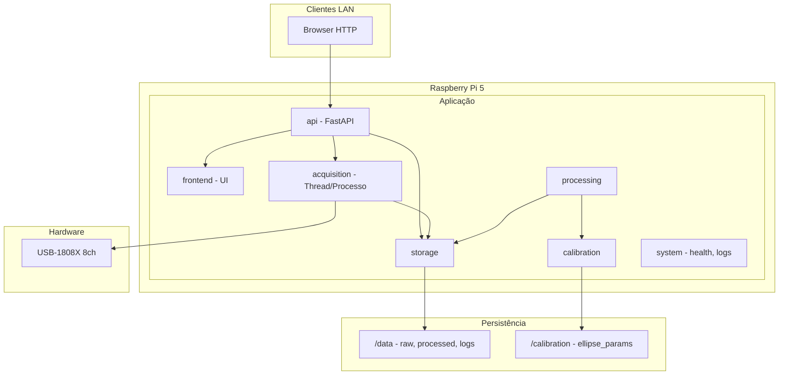

# Planejamento do projeto OAS4X API-WEB

## Arquitetura de alto nível

## Estrutura de pastas proposta

| Pasta            | Responsabilidade                                                  |
| ---------------- | ----------------------------------------------------------------- |
| **api/**         | FastAPI app, rotas REST, WebSocket/SSE, middlewares               |
| **acquisition/** | Driver uldaq, buffer circular, scan contínuo/finito, chunk writer |
| **processing/**  | RMS/DC/peak/clipping, FFT, downsample, demodulação (fase), LPF    |
| **storage/**     | Escrita BIN+JSON, leitura, listagem, rotação de arquivos          |
| **calibration/** | Fit elipse por sensor, load/save params em /calibration           |
| **system/**      | Health (uptime, CPU temp, RAM, disco, USB/DAQ), logs estruturados |
| **frontend/**    | Templates (Jinja2) + estáticos; opcional depois: React build      |

**Dados e calibração (fora do repo):**

- `/data` — `raw/`, `processed/`, `logs/` (BIN + JSON metadados por run)
- `/calibration` — JSON por sensor (ellipse_params S1..S4)

**Mapeamento sensores ↔ canais:** S1=CH0/1, S2=CH2/3, S3=CH4/5, S4=CH6/7 (fixo no código/config).

---

## Etapa 1 — Mínimo funcional (agora)

**Objetivo:** Web app na LAN; uma aquisição real; preview + métricas; salvar BIN+JSON; listar e baixar arquivos.

- **Estrutura inicial:** Criar `api/`, `acquisition/`, `processing/`, `storage/`, `frontend/`, `system/` (stub). Configurar FastAPI com CORS para LAN, servir HTML a partir de `frontend/templates` e estáticos.
- **Página "Acquisition":** Formulário: canais (checkboxes 1–8) e/ou seleção por sensores (S1–S4), sample rate, duração, range por canal (ex.: BIP5VOLTS). Botões Start / Stop. Uma aquisição por vez (bloqueante ou assíncrona em thread).
- **Aquisição real:** Reutilizar lógica de [acquire_ch1_plot_10s.py](acquire_ch1_plot_10s.py) (uldaq `a_in_scan`), estendida para 1–8 canais, ranges por canal (queue se suportado, senão range único). Executar em thread ou processo dedicado para não travar a API.
- **Preview:** Endpoint ou WebSocket/SSE que devolve: (1) últimos N pontos por canal (downsample para ~500–2k pontos) para plot; (2) valores numéricos (último valor ou média recente por canal). Frontend: página com Plotly.js ou Chart.js para plot + tabela de valores.
- **Métricas por canal:** Em [processing/](processing/): calcular RMS, DC (média), peak (max abs), clipping (count ou % acima de threshold). Retornar no JSON da run e exibir na UI.
- **Storage:** Formato por run em `/data/raw/`: `<timestamp>_<id>.bin` (bruto intercalado: ch0, ch1, … ch7, ch0, …; float32 ou int16 conforme uldaq) e `<timestamp>_<id>.json` com metadados: timestamp, fs, range por canal, duração, lista de canais, versão SW, nome do teste. Módulo em `storage/` para escrever e listar.
- **Página "Files":** Listar runs em `/data/raw/` (leitura do JSON para exibir resumo); links para download do .bin e do .json.

**Entregáveis Etapa 1:** App acessível por `http://<IP-Pi>:8000` (Ethernet/Wi-Fi); Acquisition com 1 run real; preview + métricas; gravação BIN+JSON; Files listagem e download.

---

## Etapa 2 — Robustez e 24/7

- **systemd:** Unit file em `system/oas4x.service`: executa uvicorn (ou gunicorn+uvicorn) no app FastAPI; `WorkingDirectory` no repo; auto-start no boot, restart on failure. Script de deploy em `scripts/deploy-systemd.sh` que copia a unit e faz `daemon-reload` + enable + start.
- **Logs:** Logging estruturado (JSON ou formato fixo) para stdout; opcionalmente arquivo em `/data/logs/`. Rotação por tamanho/idade.
- **Página "Health":** Endpoint `/health` ou `/api/health` que agrega: uptime do processo, CPU temp (leitura de `/sys/class/thermal/...` no Pi), RAM (e.g. `psutil`), disco (`/data`), status USB/DAQ (uldaq: listar dispositivos, opcionalmente abrir/fechar handle para checar). Frontend: página Health com esses dados atualizados (polling ou SSE).
- **Gravação independente do browser:** Aquisição e gravação rodam no backend; o cliente só dispara Start/Stop e recebe status. Chunks escritos em disco durante o scan (buffer circular em memória + flush por tempo/tamanho) para tolerar rede lenta ou desconexão.

**Entregáveis Etapa 2:** Serviço systemd; logs; Health com uptime, CPU temp, RAM, disco, status DAQ; gravação robusta em chunks.

---

## Etapa 3 — Visualização e análise de campo

- **Plot pós-aquisição:** Na página de detalhe de um run (ou nova página "Analysis"): carregar BIN via API (ou servir estático com range request). Downsample automático no backend (ex.: max 10k pontos por canal) para zoom/pan suave no frontend (Plotly ou similar).
- **FFT básica:** Endpoint que recebe run_id + canal (ou sensor); lê BIN, aplica FFT (reutilizar ideia de [mkf.py](documentos%20para%20dev/mkf.py) `fft`); retorna magnitude (e opcionalmente fase). Gráfico FFT na UI.
- **Estatísticas:** RMS em janela deslizante; P95/P99 por canal (calculados em `processing/`). Exibir na mesma tela de análise.
- **Export CSV:** Opção "Export CSV" por run: dados decimados (fator configurável) em CSV (timestamp + canais selecionados).

**Entregáveis Etapa 3:** Plot com zoom/pan e downsample; FFT por canal/sensor; estatísticas; export CSV decimado.

---

## Etapa 4 — Interferometria por sensor (calibração + demodulação)

- **Calibração:** Tela "Calibration": para cada sensor S1–S4, selecionar par de canais (CH0/1, …), coletar trecho curto (ex. 1–5 s), executar fit de elipse nos dois canais (integrar [mkf.fit_ellipse](documentos%20para%20dev/mkf.py) e `rescale`). Salvar `ellipse_params` em `/calibration/sensor_S1.json` (e S2–S4). Permitir recalibrar e sobrescrever.
- **Demodulação:** Tela "Demod": por sensor, carregar params de `/calibration`, ler dados brutos do par de canais, aplicar `demodulate` (phase = unwrap(arctan2 após rescale)) como em [OAS_Demodulate.py](documentos%20para%20dev/OAS_Demodulate.py) e [mkf.demodulate](documentos%20para%20dev/mkf.py). LPF configurável (cutoff) na fase; calcular RMS da fase. Salvar resultado "processed" em `/data/processed/` (formato a definir: JSON + array de fase ou arquivo binário). Download do resultado processado.

**Entregáveis Etapa 4:** Calibration com fit elipse e persistência em /calibration; Demod com LPF e RMS de fase; gravação em /data/processed e download.

---

## Etapa 5 — Automação para testes industriais

- **Trigger:** Modo "trigger por RMS/nível": definir threshold e canal(s); buffer de pre-trigger (ex. N segundos em buffer circular). Quando condição é atingida, gravar pre-trigger + pós-trigger em BIN+JSON. Modo "monitoramento contínuo": só calcular e exibir métricas (RMS, etc.) em tempo real, sem gravar bruto; opcionalmente log de eventos.
- **Gestão de armazenamento:** Configuração de limite (GB ou número de runs) em `/data`. Ao atingir limite, apagar runs mais antigos (por timestamp no JSON) até ficar abaixo do limite. Política: nunca apagar /calibration.
- **Autenticação:** Autenticação básica (admin): login com senha (hash em arquivo ou env); sessão/cookie ou token. Rotas críticas (Stop aquisição, Calibration, Delete files, Update) exigem admin; leitura de Files e Health podem ser públicas ou também protegidas (a critério).

**Entregáveis Etapa 5:** Trigger por RMS/nível com pre-trigger; modo monitoramento contínuo; rotação de armazenamento; autenticação admin para operações críticas.

---

## Etapa 6 — Atualização remota (OTA-lite)

- **Endpoint `/admin/update`:** Protegido por autenticação admin. Aceita parâmetro (ex. tag Git ou URL de pacote). Ações: (1) puxar release (git fetch + checkout tag, ou download + extract); (2) registrar versão instalada (arquivo em /data ou /calibration, ex. `installed_version.txt`); (3) reiniciar o serviço systemd (`systemctl restart oas4x` via subprocess com cuidado de permissões). Nunca apagar ou sobrescrever `/data` nem `/calibration` no update.
- **Rollback:** Manter última versão anterior (ex. diretório `app.prev` ou segundo tag). Endpoint `/admin/rollback` que restaura versão anterior e reinicia serviço.
- **README:** Documentar instalação (dependências, venv, uldaq, udev), execução (systemd), deploy e procedimento de update/rollback; exemplos de arquivo BIN/JSON e tabela sensor↔canais.

**Entregáveis Etapa 6:** Endpoint update + rollback; documentação de deploy e update no README.

---

## Ordem de implementação sugerida (dentro da Etapa 1)

1. Estrutura de pastas e FastAPI mínimo (rota GET `/`, servir template).
2. Módulo `acquisition` (wrapper uldaq, 1–8 canais, range, scan finito em thread).
3. Módulo `storage` (escrever BIN + JSON, listar, caminho `/data` configurável).
4. Módulo `processing` (RMS, DC, peak, clipping).
5. Rotas API: start/stop aquisição, status, preview (downsample), métricas, list files, download.
6. Frontend: Acquisition (form + plot + tabela), Files (lista + links download).
7. Teste ponta a ponta na LAN.

---

## Referências ao código existente

- **Aquisição:** [acquire_ch1_plot_10s.py](acquire_ch1_plot_10s.py) — uso de `uldaq` (DaqDevice, a_in_scan, create_float_buffer, WaitType.WAIT_UNTIL_DONE).
- **Calibração e demodulação:** [documentos para dev/mkf.py](documentos%20para%20dev/mkf.py) — `fit_ellipse(R, G)`, `rescale(R, G, param, invert=False)`, `demodulate(waveforms, param)`; [documentos para dev/OAS_Demodulate.py](documentos%20para%20dev/OAS_Demodulate.py) — fluxo de calibração e demodulação com elipse.
- **Driver:** [docs/INSTALACAO_USB1808X.md](docs/INSTALACAO_USB1808X.md) e [scripts/install_usb1808x_driver.sh](scripts/install_usb1808x_driver.sh) já utilizados.

---

## Formato BIN + JSON (resumo)

- **BIN:** Sequência de amostras intercaladas por canal: `[ch0_s0, ch1_s0, …, ch7_s0, ch0_s1, …]`. Tipo: float32 (ou int16 se conversão explícita). Sem header; metadados apenas no JSON.
- **JSON metadados:** `timestamp`, `sample_rate_hz`, `duration_s`, `channels` (lista 0–7), `range_per_channel` ou `range`, `software_version`, `test_name`, `samples_per_channel`, `binary_file`, `format` ("interleaved_float32").

Exemplo de mapeamento para documentação: S1→CH0,1; S2→CH2,3; S3→CH4,5; S4→CH6,7.